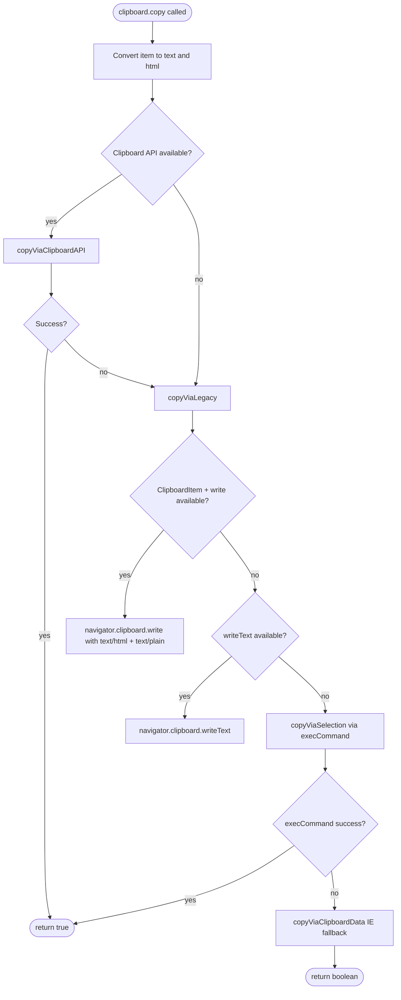
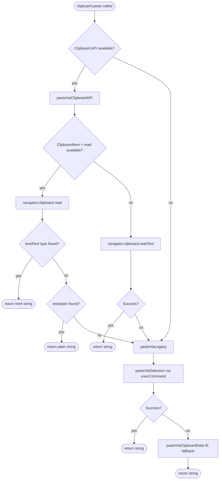
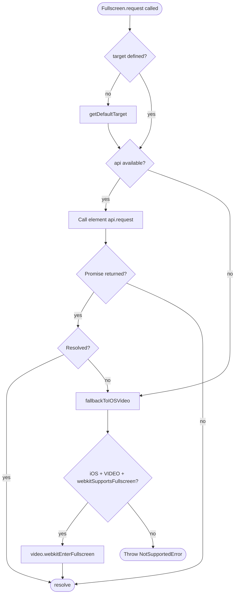
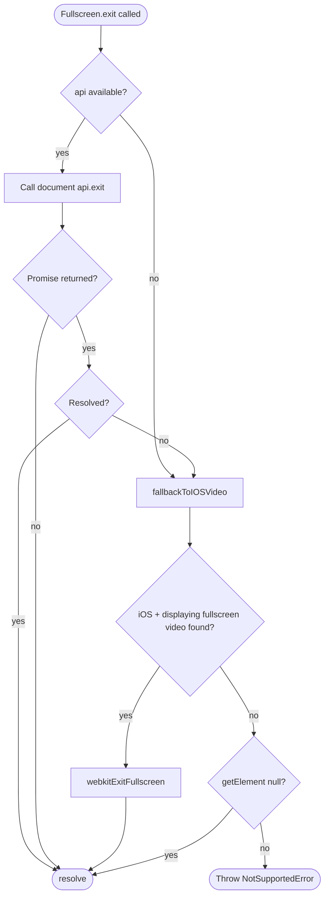
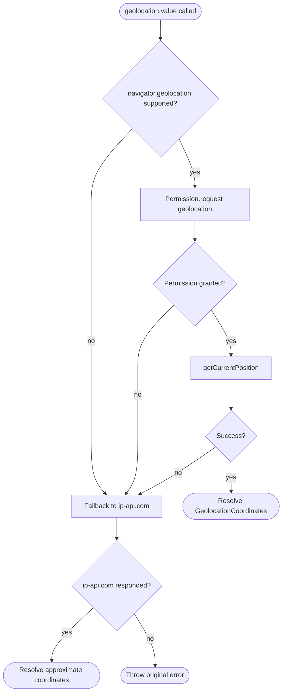
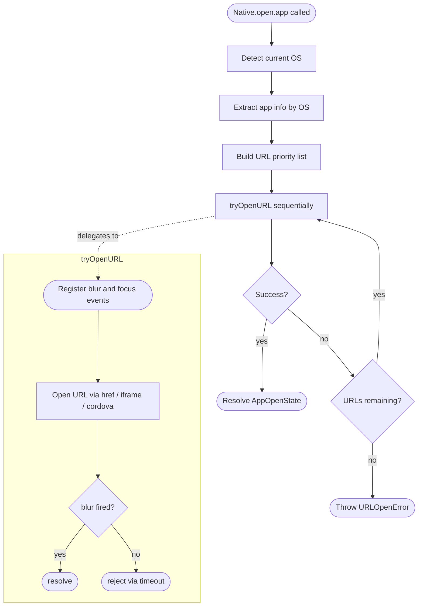
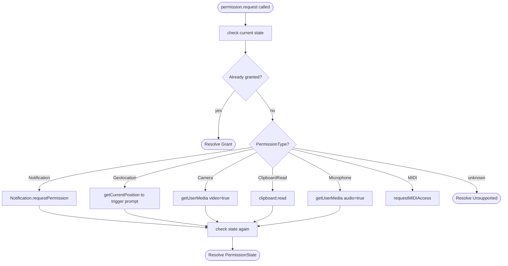
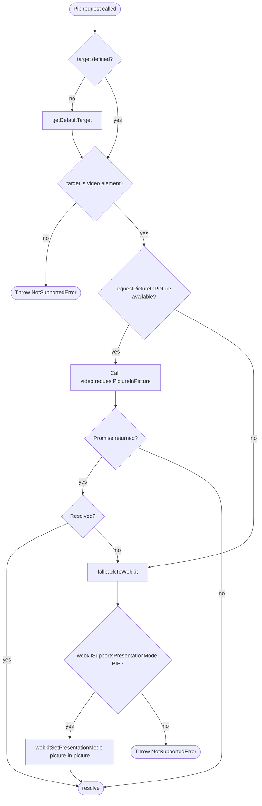
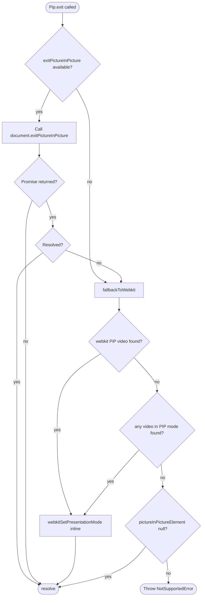

# native-fn API Reference
<a href="https://www.npmjs.com/package/native-fn"></a><br/>
<a href="https://www.npmjs.com/package/native-fn"></a>
<a href="https://www.npmjs.com/package/native-fn"></a>
<a href="https://github.com/pjy0509/native-fn"></a>
<br/>
<a href="https://www.jsdelivr.com/package/npm/native-fn" target="_blank"></a>
<a href="https://www.npmjs.com/package/native-fn" target="_blank"></a>
<a href="https://github.com/pjy0509/native-fn" target="_blank"></a>
## Installation

**npm**

```shell
npm i native-fn
```

**yarn**

```shell
yarn add native-fn
```

**unpkg**

```html
<script src="https://unpkg.com/native-fn"></script>
```

**jsdelivr**

```html
<script src="https://cdn.jsdelivr.net/npm/native-fn"></script>
```

## Table of Contents

- **[appearance](#appearance)**
    - [value](#appearance-value)
    - [onChange](#appearance-onchange)
- **[badge](#badge)**
    - [supported](#badge-supported)
    - [set](#badge-set)
    - [clear](#badge-clear)
- **[battery](#battery)**
    - [supported](#battery-supported)
    - [value](#battery-value)
    - [onChange](#battery-onchange)
- **[clipboard](#clipboard)**
    - [copy](#clipboard-copy)
    - [paste](#clipboard-paste)
- **[dimension](#dimension)**
    - [value](#dimension-value)
    - [environment](#dimension-environment)
    - [onChange](#dimension-onchange)
- **[fullscreen](#fullscreen)**
    - [supported](#fullscreen-supported)
    - [element](#fullscreen-element)
    - [isFullscreen](#fullscreen-isfullscreen)
    - [request](#fullscreen-request)
    - [exit](#fullscreen-exit)
    - [onChange](#fullscreen-onchange)
    - [onError](#fullscreen-onerror)
- **[geolocation](#geolocation)**
    - [supported](#geolocation-supported)
    - [value](#geolocation-value)
    - [onChange](#geolocation-onchange)
- **[notification](#notification)**
    - [supported](#notification-supported)
    - [send](#notification-send)
- **[open](#open)**
    - [app](#open-app)
    - [telephone](#open-telephone)
    - [message](#open-message)
    - [mail](#open-mail)
    - [file](#open-file)
    - [directory](#open-directory)
    - [setting](#open-setting)
    - [camera](#open-camera)
    - [contact](#open-contact)
    - [share](#open-share)
    - [calendar](#open-calendar)
- **[permission](#permission)**
    - [supported](#permission-supported)
    - [request](#permission-request)
    - [check](#permission-check)
- **[pip](#pip)**
    - [supported](#pip-supported)
    - [element](#pip-element)
    - [isPip](#pip-ispip)
    - [request](#pip-request)
    - [exit](#pip-exit)
    - [onChange](#pip-onchange)
    - [onError](#pip-onerror)
- **[platform](#platform)**
    - [os](#platform-os)
    - [browser](#platform-browser)
    - [engine](#platform-engine)
    - [device](#platform-device)
    - [locale](#platform-locale)
    - [gpu](#platform-gpu)
    - [userAgent](#platform-useragent)
    - [ready](#platform-ready)
    - [isWebview](#platform-iswebview)
    - [isNode](#platform-isnode)
    - [isStandalone](#platform-isstandalone)
- **[theme](#theme)**
    - [value](#theme-value)
- **[vibration](#vibration)**
    - [supported](#vibration-supported)
    - [run](#vibration-run)
    - [stop](#vibration-stop)

## appearance

[`value`](#appearance-value) · [`onChange`](#appearance-onchange)

<h3 id="appearance-value"><code>appearance.value</code></h3>

**Signature**

```ts
get value(): Appearances
```

Returns the current color scheme of the device.

**Example**

```ts
console.log(Native.appearance.value); // 'dark' | 'light' | 'unknown'
```

**Returns**

```ts
Appearances
```


```ts
enum Appearances {
    Unknown = 'unknown',
    Light   = 'light',
    Dark    = 'dark',
}
```

---

<h3 id="appearance-onchange"><code>appearance.onChange</code></h3>

**Signature**

```ts
onChange(listener: (appearance: Appearances) => void, options?: AddEventListenerOptions): () => void
```

Subscribes to device color scheme changes.

**Example**

```ts
const unsubscribe = Native.appearance.onChange((appearance) => {
    console.log(appearance); // 'dark' | 'light'
});

unsubscribe();
```

**Returns**

```ts
() => void
```


```ts
// call to remove the listener
unsubscribe();
```

---

## badge

[`supported`](#badge-supported) · [`set`](#badge-set) · [`clear`](#badge-clear)

<h3 id="badge-supported"><code>badge.supported</code></h3>

**Signature**

```ts
get supported(): boolean
```

Returns whether badge is supported in the current environment.

**Example**

```ts
if (Native.badge.supported) {
    await Native.badge.set(5);
}
```

**Returns**

```ts
boolean
```


```ts
// true  — badge API support,
// false — no badge support
```

---

<h3 id="badge-set"><code>badge.set</code></h3>

**Signature**

```ts
set(contents: number): Promise<void>
```

Sets the app badge count.

**Example**

```ts
await Native.badge.set(5);
```

**Returns**

```ts
Promise<void>
```


**Throws**

```ts
throw new NotSupportedError // navigator.setAppBadge unavailable
```

---

<h3 id="badge-clear"><code>badge.clear</code></h3>

**Signature**

```ts
clear(): Promise<void>
```

Clears the app badge.

**Example**

```ts
await Native.badge.clear();
```

**Returns**

```ts
Promise<void>
```


**Throws**

```ts
throw new NotSupportedError // navigator.setAppBadge unavailable
```

---

## battery

[`supported`](#battery-supported) · [`value`](#battery-value) · [`onChange`](#battery-onchange)

<h3 id="battery-supported"><code>battery.supported</code></h3>

**Signature**

```ts
get supported(): boolean
```

Returns whether battery is supported in the current environment.

**Example**

```ts
if (Native.battery.supported) {
    const battery = await Native.battery.value;

    console.log(battery.level); // 0.0 – 1.0
}
```

**Returns**

```ts
boolean
```


```ts
// true  — battery API support,
// false — no battery support
```

---

<h3 id="battery-value"><code>battery.value</code></h3>

**Signature**

```ts
get value(): Promise<BatteryManager>
```

Returns the current battery status.

**Example**

```ts
const battery = await Native.battery.value;

console.log(battery.level);           // 0.0 – 1.0
console.log(battery.charging);        // true | false
console.log(battery.chargingTime);    // seconds until full
console.log(battery.dischargingTime); // seconds until empty
```

**Returns**

```ts
Promise<BatteryManager>
```


```ts
interface BatteryManager {
    readonly charging:          boolean;
    readonly chargingTime:      number;
    readonly dischargingTime:   number;
    readonly level:             number;
}
```

**Throws**

```ts
throw new NotSupportedError // navigator.getBattery unavailable
```

---

<h3 id="battery-onchange"><code>battery.onChange</code></h3>

**Signature**

```ts
onChange(listener: (battery: BatteryManager) => void, options?: AddEventListenerOptions): () => void
```

Subscribes to battery status changes.

**Example**

```ts
const unsubscribe = Native.battery.onChange((battery) => {
    console.log(battery.level);    // 0.0 – 1.0
    console.log(battery.charging); // true | false
});

unsubscribe();
```

**Returns**

```ts
() => void
```


```ts
// call to remove the listener
unsubscribe();
```

---

## clipboard

[`copy`](#clipboard-copy) · [`paste`](#clipboard-paste)

<h3 id="clipboard-copy"><code>clipboard.copy</code></h3>

**Signature**

```ts
copy(item: any): Promise<boolean>
```

Copies a value to the clipboard. Accepts string, Element, Selection, object, or array.

**Flowchart**



**Example**

```ts
// String
await Native.clipboard.copy('Hello world');

// DOM element (copies outerHTML + textContent)
await Native.clipboard.copy(document.querySelector('.content'));

// Object → serialized as JSON
await Native.clipboard.copy({ key: 'value' });

// Current selection
await Native.clipboard.copy(window.getSelection());
```

**Returns**

```ts
Promise<boolean>
```


---

<h3 id="clipboard-paste"><code>clipboard.paste</code></h3>

**Signature**

```ts
paste(): Promise<string>
```

Reads the current clipboard content as a string.

**Flowchart**



**Example**

```ts
const text = await Native.clipboard.paste();

console.log(text); // HTML string if available, plain text otherwise
```

**Returns**

```ts
Promise<string>
```


---

## dimension

[`value`](#dimension-value) · [`environment`](#dimension-environment) · [`onChange`](#dimension-onchange)

<h3 id="dimension-value"><code>dimension.value</code></h3>

**Signature**

```ts
get value(): Dimensions
```

Returns current viewport dimensions, device pixel ratio, and orientation.

**Example**

```ts
const { innerWidth, innerHeight, outerWidth, outerHeight, scale, orientation } = Native.dimension.value;

console.log(innerWidth, innerHeight); // visible viewport size
console.log(scale);                   // device pixel ratio e.g. 2, 3

if (orientation === Orientation.Portrait) {
    console.log('Portrait mode');
}
```

**Returns**

```ts
Dimensions
```


```ts
interface Dimensions {
    outerWidth:  number;
    outerHeight: number;
    innerWidth:  number;
    innerHeight: number;
    scale:       number;
    orientation: Orientation;
}

enum Orientation {
    Portrait  = 'portrait',
    Landscape = 'landscape',
    Unknown   = 'unknown',
}
```

---

<h3 id="dimension-environment"><code>dimension.environment</code></h3>

**Signature**

```ts
environment: Environment
```

Provides access to CSS environment variable values: safe-area-inset, keyboard-inset, titlebar-area, and viewport-segment.

**Example**

```ts
// Safe area insets (e.g. iPhone notch / Dynamic Island)
const inset = Native.dimension.environment.safeAreaInset.value;
console.log(inset.top, inset.bottom, inset.left, inset.right);

// Virtual keyboard height
const kb = Native.dimension.environment.keyboardInset.value;
console.log(kb.height); // 0 when keyboard is hidden

// Subscribe to safe area changes
const unsubscribe = Native.dimension.environment.safeAreaInset.onChange((inset) => {
    document.body.style.paddingBottom = inset.bottom + 'px';
});
unsubscribe();
```

**Returns**

```ts
Environment
```


```ts
interface Environment {
    safeAreaInset:    EnvironmentPreset<'safe-area-inset'>;
    safeAreaMaxInset: EnvironmentPreset<'safe-area-max-inset'>;
    keyboardInset:    EnvironmentPreset<'keyboard-inset'>;
    titlebarArea:     EnvironmentPreset<'titlebar-area'>;
    viewportSegment:  EnvironmentPreset<'viewport-segment'>;
}

interface EnvironmentPreset<K> {
    get value(): EnvironmentPresetValues<K>;
    onChange(listener: (value: EnvironmentPresetValues<K>) => void, options?: AddEventListenerOptions): () => void;
}
```

---

<h3 id="dimension-onchange"><code>dimension.onChange</code></h3>

**Signature**

```ts
onChange(listener: (dimension: Dimensions) => void, options?: AddEventListenerOptions): () => void
```

Subscribes to viewport dimension and orientation changes.

**Example**

```ts
const unsubscribe = Native.dimension.onChange((dimension) => {
    console.log(dimension.innerWidth, dimension.innerHeight);
    console.log(dimension.orientation); // 'portrait' | 'landscape'
});

unsubscribe();
```

**Returns**

```ts
() => void
```


```ts
// call to remove the listener
unsubscribe();
```

---

## fullscreen

[`supported`](#fullscreen-supported) · [`element`](#fullscreen-element) · [`isFullscreen`](#fullscreen-isfullscreen) · [`request`](#fullscreen-request) · [`exit`](#fullscreen-exit) · [`onChange`](#fullscreen-onchange) · [`onError`](#fullscreen-onerror)

<h3 id="fullscreen-supported"><code>fullscreen.supported</code></h3>

**Signature**

```ts
get supported(): boolean
```

Returns whether fullscreen is supported in the current environment.

**Example**

```ts
if (Native.fullscreen.supported) {
    await Native.fullscreen.request();
}
```

**Returns**

```ts
boolean
```


```ts
// true  — standard or vendor-prefixed fullscreen API detected,
//         or iOS video with webkitSupportsFullscreen
// false — no fullscreen support
```

---

<h3 id="fullscreen-element"><code>fullscreen.element</code></h3>

**Signature**

```ts
get element(): Element | null
```

Returns the element currently displayed in fullscreen, or null if not in fullscreen.

**Example**

```ts
const el = Native.fullscreen.element;

if (el !== null) {
    console.log(el.tagName); // e.g. 'VIDEO', 'DIV'
}
```

**Returns**

```ts
Element | null
```


```ts
// Element — the current fullscreen element
// null    — not in fullscreen
```

---

<h3 id="fullscreen-isfullscreen"><code>fullscreen.isFullscreen</code></h3>

**Signature**

```ts
get isFullscreen(): boolean
```

Returns whether fullscreen is currently active.

**Example**

```ts
console.log(Native.fullscreen.isFullscreen); // true | false
```

**Returns**

```ts
boolean
```


---

<h3 id="fullscreen-request"><code>fullscreen.request</code></h3>

**Signature**

```ts
request(target?: Element, options?: FullscreenOptions): Promise<void>
```

Requests fullscreen for an element.

**Flowchart**



**Example**

```ts
// Default: documentElement on desktop, first video on iOS
await Native.fullscreen.request();

// Specific element
await Native.fullscreen.request(document.getElementById('player'));

// With options
await Native.fullscreen.request(element, { navigationUI: 'hide' });
```

**Returns**

```ts
Promise<void>
```


**Throws**

```ts
throw new NotSupportedError // element does not support fullscreen
```
```ts
throw new NotSupportedError // iOS video lacks webkitEnterFullscreen
```
```ts
throw new InvalidStateError // iOS video not yet played
```

---

<h3 id="fullscreen-exit"><code>fullscreen.exit</code></h3>

**Signature**

```ts
exit(): Promise<void>
```

Exits fullscreen.

**Flowchart**



**Example**

```ts
await Native.fullscreen.exit();
```

**Returns**

```ts
Promise<void>
```


**Throws**

```ts
throw new NotSupportedError // failed to exit fullscreen
```

---

<h3 id="fullscreen-onchange"><code>fullscreen.onChange</code></h3>

**Signature**

```ts
onChange(listener: (payload: FullscreenEventPayload) => void, options?: AddEventListenerOptions): () => void
```

Subscribes to fullscreen state changes.

**Example**

```ts
const unsubscribe = Native.fullscreen.onChange((payload) => {
    console.log(payload.isFullscreen); // true | false
    console.log(payload.element);      // Element
    console.log(payload.nativeEvent);  // Event
});

unsubscribe();
```

**Returns**

```ts
() => void
```


```ts
// call to remove the listener
unsubscribe();
```

---

<h3 id="fullscreen-onerror"><code>fullscreen.onError</code></h3>

**Signature**

```ts
onError(listener: (payload: FullscreenEventPayload) => void, options?: AddEventListenerOptions): () => void
```

Subscribes to fullscreen errors.

**Example**

```ts
const unsubscribe = Native.fullscreen.onError((payload) => {
    console.log(payload.isFullscreen); // boolean
    console.log(payload.element);      // Element
    console.log(payload.nativeEvent);  // Event
});

unsubscribe();
```

**Returns**

```ts
() => void
```


```ts
// call to remove the listener
unsubscribe();
```

---

## geolocation

[`supported`](#geolocation-supported) · [`value`](#geolocation-value) · [`onChange`](#geolocation-onchange)

<h3 id="geolocation-supported"><code>geolocation.supported</code></h3>

**Signature**

```ts
get supported(): boolean
```

Returns whether geolocation is supported in the current environment.

**Example**

```ts
if (Native.geolocation.supported) {
    const coords = await Native.geolocation.value;

    console.log(coords.latitude, coords.longitude);
}
```

**Returns**

```ts
boolean
```


```ts
// true  — geolocation API support,
// false — no geolocation support
```

---

<h3 id="geolocation-value"><code>geolocation.value</code></h3>

**Signature**

```ts
get value(): Promise<GeolocationCoordinates>
```

Returns the current geographic coordinates. Falls back to IP-based location if the Geolocation API is unavailable or permission is denied.

**Flowchart**



**Example**

```ts
const coords = await Native.geolocation.value;

console.log(coords.latitude, coords.longitude);
console.log(coords.accuracy); // -1 when resolved via IP fallback
```

**Returns**

```ts
Promise<GeolocationCoordinates>
```


```ts
interface GeolocationCoordinates {
    readonly latitude:         number;
    readonly longitude:        number;
    readonly accuracy:         number;  // -1 when resolved via IP fallback
    readonly altitude:         number | null;
    readonly altitudeAccuracy: number | null;
    readonly heading:          number | null;
    readonly speed:            number | null;
}
```

**Throws**

```ts
throw new NotSupportedError // geolocation unavailable and IP fallback failed
```
```ts
throw new PermissionNotGrantedError // permission denied and IP fallback failed
```

---

<h3 id="geolocation-onchange"><code>geolocation.onChange</code></h3>

**Signature**

```ts
onChange(listener: (coordinates: GeolocationCoordinates) => void, options?: AddEventListenerOptions): () => void
```

Subscribes to geographic position changes.

**Example**

```ts
const unsubscribe = Native.geolocation.onChange((coords) => {
    console.log(coords.latitude, coords.longitude);
    console.log(coords.accuracy); // meters
});

unsubscribe();
```

**Returns**

```ts
() => void
```


```ts
// call to remove the listener
unsubscribe();
```

---

## notification

[`supported`](#notification-supported) · [`send`](#notification-send)

<h3 id="notification-supported"><code>notification.supported</code></h3>

**Signature**

```ts
get supported(): boolean
```

Returns whether notification is supported in the current environment.

**Example**

```ts
if (Native.notification.supported) {
    await Native.notification.send({
        title: 'Hello',
        body:  'You have a new message.',
        icon:  '/icon.png',
    });
}
```

**Returns**

```ts
boolean
```


```ts
// true  — notification API support,
// false — no notification support
```

---

<h3 id="notification-send"><code>notification.send</code></h3>

**Signature**

```ts
send(options: NotificationOptions): Promise<Notification>
```

Sends a native notification after requesting permission.

**Example**

```ts
// Basic notification
const notification = await Native.notification.send({
    title: 'Hello',
    body:  'You have a new message.',
    icon:  '/icon.png',
});

// With event handlers
const notification = await Native.notification.send({
    title:   'Download complete',
    body:    'your-file.zip is ready.',
    onClick: () => window.focus(),
    onClose: () => console.log('dismissed'),
});

// Close the notification programmatically.
notification.close();
```

**Returns**

```ts
Promise<Notification>
```


```ts
interface NotificationOptions {
    title:               string;
    badge?:              string;
    body?:               string;
    data?:               any;
    dir?:                NotificationDirection;
    icon?:               string;
    lang?:               string;
    requireInteraction?: boolean;
    silent?:             boolean | null;
    tag?:                string;
    onClick?:            (event: Event) => any;
    onClose?:            (event: Event) => any;
    onError?:            (event: Event) => any;
    onShow?:             (event: Event) => any;
}
```

**Throws**

```ts
throw new NotSupportedError // window.Notification unavailable
```
```ts
throw new PermissionNotGrantedError // notification permission denied
```

---

## open

[`app`](#open-app) · [`telephone`](#open-telephone) · [`message`](#open-message) · [`mail`](#open-mail) · [`file`](#open-file) · [`directory`](#open-directory) · [`setting`](#open-setting) · [`camera`](#open-camera) · [`contact`](#open-contact) · [`share`](#open-share) · [`calendar`](#open-calendar)

<h3 id="open-app"><code>open.app</code></h3>

**Signature**

```ts
app(options: AppOpenOptions): Promise<AppOpenState>
```

Opens a native app. Falls back through multiple URL strategies until one succeeds.

**Flowchart**



**Example**

```ts
try {
    const result = await Native.open.app({
        android: {
            scheme: 'ms-excel://',
            packageName: 'com.microsoft.office.excel',
            allowAppStore: true,
            // allowWebStore: false,
            // intent: 'intent://#Intent;scheme=ms-excel;...',
            // fallback: 'https://www.microsoft.com/ko-kr/microsoft-365/excel',
            // timeout: 1000,
        },
        ios: {
            scheme: 'ms-excel://',
            trackId: '586683407',
            allowAppStore: true,
            // allowWebStore: false,
            // universal: '',
            // bundleId: 'com.microsoft.Office.Excel',
            // fallback: 'https://www.microsoft.com/ko-kr/microsoft-365/excel',
            // timeout: 2000,
        },
        windows: {
            scheme: 'ms-excel://',
            productId: 'cfq7ttc0pr28',
            allowAppStore: true,
            // allowWebStore: false,
            // fallback: 'https://www.microsoft.com/ko-kr/microsoft-365/excel',
            // timeout: 750,
        },
        macos: {
            scheme: 'ms-excel://',
            trackId: '462058435',
            allowAppStore: true,
            // allowWebStore: false,
            // bundleId: 'com.microsoft.Excel',
            // fallback: 'https://www.microsoft.com/ko-kr/microsoft-365/excel',
            // timeout: 750,
        },
    });

    switch (result) {
        AppOpenState.Intent:
            console.log('Opened via Android intent.');    break;
            AppOpenState.Universal:
            console.log('Opened via Universal Link.');    break;
            AppOpenState.Scheme:
            console.log('Opened via custom scheme.');     break;
            AppOpenState.Fallback:
            console.log('Opened via fallback URL.');      break;
            AppOpenState.Store:
            console.log('Redirected to App Store.');      break;
    }
} catch (e) {
    if (e instanceof Native.open.Errors.URLOpenError) {
        console.error('All URLs exhausted:', e.message);
    }
}
```

**Returns**

```ts
Promise<AppOpenState>
```


```ts
enum AppOpenState {
    Intent    = 'Intent',
    Universal = 'Universal',
    Scheme    = 'Scheme',
    Fallback  = 'Fallback',
    Store     = 'Store',
}
```

**Throws**

```ts
throw new URLOpenError // all candidate URLs were tried and none succeeded
```

---

<h3 id="open-telephone"><code>open.telephone</code></h3>

**Signature**

```ts
telephone(options: TelephoneOptions): Promise<void>
```

Opens the native phone dialer.

**Example**

```ts
await Native.open.telephone({ to: '+821012345678' });
```

**Returns**

```ts
Promise<void>
```


**Throws**

```ts
throw new URLOpenError // failed to open the phone dialer
```

---

<h3 id="open-message"><code>open.message</code></h3>

**Signature**

```ts
message(options: MessageOptions): Promise<void>
```

Opens the native SMS app.

**Example**

```ts
// With pre-filled body
await Native.open.message({
    to:   '+821012345678',
    body: 'Hello from Native.open!',
});
```

**Returns**

```ts
Promise<void>
```


**Throws**

```ts
throw new URLOpenError // failed to open the SMS app
```

---

<h3 id="open-mail"><code>open.mail</code></h3>

**Signature**

```ts
mail(options: MailOptions): Promise<void>
```

Opens the native mail client.

**Example**

```ts
// Single recipient
await Native.open.mail({
    to:      'hello@example.com',
    subject: 'Greetings',
    body:    'Hi there!',
});

// Multiple recipients with cc / bcc
await Native.open.mail({
    to:      ['hello@example.com', 'world@example.com'],
    cc:      'cc@example.com',
    bcc:     'bcc@example.com',
    subject: 'Greetings',
    body:    'Hi there!',
});
```

**Returns**

```ts
Promise<void>
```


**Throws**

```ts
throw new URLOpenError // failed to open the mail client
```

---

<h3 id="open-file"><code>open.file</code></h3>

**Signature**

```ts
file(options?: FileOptions): Promise<File[]>
```

Opens a file picker dialog.

**Example**

```ts
// Single file
const [file] = await Native.open.file({
    accept: ['.pdf'],
});

// Multiple files with type filter
const files = await Native.open.file({
    multiple: true,
    accept:   ['.png', '.jpg', 'image/webp'],
    startIn:  ExplorerStartIn.Pictures,
});
```

**Returns**

```ts
Promise<File[]>
```


**Throws**

```ts
throw new UserCancelledError // user dismissed the picker
```
```ts
throw new NotSupportedError // showOpenFilePicker and input fallback both unavailable
```

---

<h3 id="open-directory"><code>open.directory</code></h3>

**Signature**

```ts
directory(options?: DirectoryOptions): Promise<FileWithPath[]>
```

Opens a directory picker and returns all files with their relative paths.

**Example**

```ts
// Read-only
const entries = await Native.open.directory();

// Read-write
const entries = await Native.open.directory({
    mode: DirectoryExploreMode.ReadWrite,
});

entries.forEach(({ file, relativePath }) => {
    console.log(relativePath, file.size); // 'src/index.ts', 1024
});
```

**Returns**

```ts
Promise<FileWithPath[]>
```


```ts
interface FileWithPath {
    file:         File;
    relativePath: string;
}
```

**Throws**

```ts
throw new NotSupportedError // showDirectoryPicker and webkitdirectory both unavailable
```
```ts
throw new UserCancelledError // user dismissed the picker
```

---

<h3 id="open-setting"><code>open.setting</code></h3>

**Signature**

```ts
setting(type: SettingType): Promise<void>
```

Opens a system settings screen. iOS is unsupported.

**Example**

```ts
// General settings
await Native.open.setting(SettingType.General);

// Accessibility settings
await Native.open.setting(SettingType.Accessibility);

// Battery settings (Android 5.1+)
await Native.open.setting(SettingType.Battery);
```

**Returns**

```ts
Promise<void>
```


**Throws**

```ts
throw new URLOpenError // canOpenSetting() returned false
```
```ts
throw new URLOpenError // all setting URLs failed
```

---

<h3 id="open-camera"><code>open.camera</code></h3>

**Signature**

```ts
camera(options?: CameraOptions): Promise<File[]>
```

Opens the device camera.

**Example**

```ts
// Rear-facing photo (default)
const [photo] = await Native.open.camera();

// Front-facing video
const [video] = await Native.open.camera({
    type:    CameraType.Video,
    capture: CaptureType.User,
});
```

**Returns**

```ts
Promise<File[]>
```


**Throws**

```ts
throw new UserCancelledError // user dismissed the camera UI
```

---

<h3 id="open-contact"><code>open.contact</code></h3>

**Signature**

```ts
contact(options?: ContactOptions): Promise<Contact[]>
```

Opens the native contact picker.

**Example**

```ts
// Single contact
const [contact] = await Native.open.contact();
console.log(contact.name, contact.tel);

// Multiple contacts
const contacts = await Native.open.contact({ multiple: true });
contacts.forEach((c) => console.log(c.name, c.email));
```

**Returns**

```ts
Promise<Contact[]>
```


```ts
interface Contact {
    name?:    string;
    email?:   string;
    tel?:     string;
    address?: string;
    icon?:    Blob[];
}
```

**Throws**

```ts
throw new NotSupportedError // navigator.contacts unavailable
```

---

<h3 id="open-share"><code>open.share</code></h3>

**Signature**

```ts
share(options: ShareData): Promise<void>
```

Opens the native OS share sheet.

**Example**

```ts
// Share a URL
await Native.open.share({
    title: 'Check this out',
    url:   'https://example.com',
});

// Share text and URL
await Native.open.share({
    title: 'Check this out',
    text:  'Shared via Native.open',
    url:   'https://example.com',
});
```

**Returns**

```ts
Promise<void>
```


**Throws**

```ts
throw new NotSupportedError // navigator.share unavailable or canShare() false
```
```ts
throw new UserCancelledError // user dismissed the share sheet
```

---

<h3 id="open-calendar"><code>open.calendar</code></h3>

**Signature**

```ts
calendar(options: CalendarOptions): void
```

Generates an RFC 5545 .ics file and triggers a download to open in the default calendar app.

**Example**

```ts
// Basic event
Native.open.calendar({
    title:       'Team Sync',
    description: 'Weekly alignment meeting',
    location:    'Seoul, Korea',
    startDate:   new Date('2026-04-01T10:00:00Z'),
    endDate:     new Date('2026-04-01T11:00:00Z'),
});

// Recurring event with alarm
Native.open.calendar({
    title:     'Weekly Standup',
    startDate: new Date('2026-04-01T09:00:00Z'),
    endDate:   new Date('2026-04-01T09:15:00Z'),
    alarm:     [{ minutes: 10, before: true }],
    recur:     { frequency: 'WEEKLY', byDay: ['MO'], count: 12 },
});

// All-day event
Native.open.calendar({
    title:     'Company Holiday',
    allDay:    true,
    startDate: new Date('2026-05-05T00:00:00Z'),
    endDate:   new Date('2026-05-05T00:00:00Z'),
});
```

**Returns**

```ts
void
```


---

## permission

[`supported`](#permission-supported) · [`request`](#permission-request) · [`check`](#permission-check)

<h3 id="permission-supported"><code>permission.supported</code></h3>

**Signature**

```ts
get supported(): boolean
```

Returns whether permission is supported in the current environment.

**Example**

```ts
if (Native.permission.supported) {
    const state = await Native.permission.check(PermissionType.Geolocation);
}
```

**Returns**

```ts
boolean
```


```ts
// true  — permission API support,
// false — no permission support
```

---

<h3 id="permission-request"><code>permission.request</code></h3>

**Signature**

```ts
request(type: PermissionType): Promise<PermissionState>
```

Requests a permission. Resolves immediately if already granted.

**Flowchart**



**Example**

```ts
const state = await Native.permission.request(PermissionType.Notification);

switch (state) {
    case PermissionState.Grant:
        console.log('Permission granted.');  break;
    case PermissionState.Denied:
        console.log('Permission denied.');   break;
    case PermissionState.Prompt:
        console.log('Not yet decided.');     break;
    case PermissionState.Unsupported:
        console.log('Not supported.');       break;
}
```

**Returns**

```ts
Promise<PermissionState>
```


```ts
enum PermissionType {
    Notification  = 'notifications',
    Geolocation   = 'geolocation',
    Camera        = 'camera',
    ClipboardRead = 'clipboard-read',
    Microphone    = 'microphone',
    MIDI          = 'midi',
}

enum PermissionState {
    Grant       = 'grant',
    Denied      = 'denied',
    Prompt      = 'prompt',
    Unsupported = 'unsupported',
}
```

---

<h3 id="permission-check"><code>permission.check</code></h3>

**Signature**

```ts
check(type: PermissionType): Promise<PermissionState>
```

Returns the current permission state without triggering a prompt.

**Example**

```ts
// Check before accessing a feature
const state = await Native.permission.check(PermissionType.Geolocation);

if (state === PermissionState.Grant) {
    const coords = await Native.geolocation.value;
}
```

**Returns**

```ts
Promise<PermissionState>
```


```ts
enum PermissionState {
    Grant       = 'grant',
    Denied      = 'denied',
    Prompt      = 'prompt',
    Unsupported = 'unsupported',
}
```

---

## pip

[`supported`](#pip-supported) · [`element`](#pip-element) · [`isPip`](#pip-ispip) · [`request`](#pip-request) · [`exit`](#pip-exit) · [`onChange`](#pip-onchange) · [`onError`](#pip-onerror)

<h3 id="pip-supported"><code>pip.supported</code></h3>

**Signature**

```ts
get supported(): boolean
```

Returns whether Picture-in-Picture is supported in the current environment.

**Example**

```ts
if (Native.pip.supported) {
    await Native.pip.request();
}
```

**Returns**

```ts
boolean
```


```ts
// true  — document.pictureInPictureEnabled is true,
//         or a video with webkitSupportsPresentationMode('picture-in-picture') exists
// false — no PiP support
```

---

<h3 id="pip-element"><code>pip.element</code></h3>

**Signature**

```ts
get element(): HTMLVideoElement | null
```

Returns the video element currently in Picture-in-Picture, or null if not active.

**Example**

```ts
const el = Native.pip.element;

if (el !== null) {
    console.log(el.src); // currently PiP video source
}
```

**Returns**

```ts
HTMLVideoElement | null
```


```ts
// HTMLVideoElement — the current PiP video
// null            — not in PiP
```

---

<h3 id="pip-ispip"><code>pip.isPip</code></h3>

**Signature**

```ts
get isPip(): boolean
```

Returns whether Picture-in-Picture is currently active.

**Example**

```ts
console.log(Native.pip.isPip); // true | false
```

**Returns**

```ts
boolean
```


---

<h3 id="pip-request"><code>pip.request</code></h3>

**Signature**

```ts
request(target?: HTMLVideoElement): Promise<void>
```

Requests Picture-in-Picture for a video element.

**Flowchart**



**Example**

```ts
// Default: first video element
await Native.pip.request();

// Specific video element
await Native.pip.request(document.querySelector('video#player'));
```

**Returns**

```ts
Promise<void>
```


**Throws**

```ts
throw new NotSupportedError // target is not a video element
```
```ts
throw new NotSupportedError // PiP disabled on this element (disablePictureInPicture)
```
```ts
throw new NotSupportedError // requestPictureInPicture and webkitSetPresentationMode both unavailable
```
```ts
throw new InvalidStateError // PiP transition already in progress
```

---

<h3 id="pip-exit"><code>pip.exit</code></h3>

**Signature**

```ts
exit(): Promise<void>
```

Exits Picture-in-Picture.

**Flowchart**



**Example**

```ts
await Native.pip.exit();
```

**Returns**

```ts
Promise<void>
```


**Throws**

```ts
throw new NotSupportedError // failed to exit PiP
```

---

<h3 id="pip-onchange"><code>pip.onChange</code></h3>

**Signature**

```ts
onChange(listener: (payload: PipEventPayload) => void, options?: AddEventListenerOptions): () => void
```

Subscribes to Picture-in-Picture state changes.

**Example**

```ts
const unsubscribe = Native.pip.onChange((payload) => {
    console.log(payload.isPip);       // true | false
    console.log(payload.element);     // HTMLVideoElement
    console.log(payload.nativeEvent); // Event
});

unsubscribe();
```

**Returns**

```ts
() => void
```


```ts
// call to remove the listener
unsubscribe();
```

---

<h3 id="pip-onerror"><code>pip.onError</code></h3>

**Signature**

```ts
onError(listener: (payload: PipEventPayload) => void, options?: AddEventListenerOptions): () => void
```

Subscribes to Picture-in-Picture errors.

**Example**

```ts
const unsubscribe = Native.pip.onError((payload) => {
    console.log(payload.isPip);       // boolean
    console.log(payload.element);     // HTMLVideoElement
    console.log(payload.nativeEvent); // Event
});

unsubscribe();
```

**Returns**

```ts
() => void
```


```ts
// call to remove the listener
unsubscribe();
```

---

## platform

[`os`](#platform-os) · [`browser`](#platform-browser) · [`engine`](#platform-engine) · [`device`](#platform-device) · [`locale`](#platform-locale) · [`gpu`](#platform-gpu) · [`userAgent`](#platform-useragent) · [`ready`](#platform-ready) · [`isWebview`](#platform-iswebview) · [`isNode`](#platform-isnode) · [`isStandalone`](#platform-isstandalone)

<h3 id="platform-os"><code>platform.os</code></h3>

**Signature**

```ts
get os(): NameVersionPair<OS>
```

Returns the detected OS name and version.

**Example**

```ts
const { name, version } = Native.platform.os;

switch (name) {
    case OS.iOS:
        console.log('iOS', version);     break;
    case OS.Android:
        console.log('Android', version); break;
    case OS.Windows:
        console.log('Windows', version); break;
    case OS.MacOS:
        console.log('macOS', version);   break;
}
```

**Returns**

```ts
NameVersionPair<OS>
```


```ts
interface NameVersionPair<T> {
    name:    T;
    version: string;
}

enum OS {
    Unknown = 'Unknown',
    Android = 'Android',
    iOS     = 'iOS',
    Windows = 'Windows',
    MacOS   = 'MacOS',
}
```

---

<h3 id="platform-browser"><code>platform.browser</code></h3>

**Signature**

```ts
get browser(): NameVersionPair<Browsers>
```

Returns the detected browser name and version.

**Example**

```ts
const { name, version } = Native.platform.browser;

if (name === Browsers.Safari) {
    console.log('Safari', version); // e.g. '17.0'
}
```

**Returns**

```ts
NameVersionPair<Browsers>
```


```ts
enum Browsers {
    Unknown         = 'Unknown',
    Chrome          = 'Chrome',
    Safari          = 'Safari',
    Edge            = 'Edge',
    Firefox         = 'Firefox',
    Opera           = 'Opera',
    IE              = 'IE',
    SamsungInternet = 'SamsungInternet',
}
```

---

<h3 id="platform-engine"><code>platform.engine</code></h3>

**Signature**

```ts
get engine(): NameVersionPair<Engines>
```

Returns the detected rendering engine name and version.

**Example**

```ts
const { name, version } = Native.platform.engine;

if (name === Engines.Blink) {
    console.log('Blink', version); // e.g. '120.0.6099.62'
}
```

**Returns**

```ts
NameVersionPair<Engines>
```


```ts
enum Engines {
    Unknown  = 'Unknown',
    EdgeHTML = 'EdgeHTML',
    ArkWeb   = 'ArkWeb',
    Blink    = 'Blink',
    Presto   = 'Presto',
    WebKit   = 'WebKit',
    Trident  = 'Trident',
    Gecko    = 'Gecko',
}
```

---

<h3 id="platform-device"><code>platform.device</code></h3>

**Signature**

```ts
get device(): Devices
```

Returns the device category: Mobile, Desktop, or Unknown.

**Example**

```ts
if (Native.platform.device === Devices.Mobile) {
    console.log('Running on a mobile device');
}
```

**Returns**

```ts
Devices
```


```ts
enum Devices {
    Unknown = 'Unknown',
    Mobile  = 'Mobile',
    Desktop = 'Desktop',
}
```

---

<h3 id="platform-locale"><code>platform.locale</code></h3>

**Signature**

```ts
get locale(): Locale
```

Returns the current locale, timezone, UTC offset, and text direction.

**Example**

```ts
const { language, languages, timezone, offset, isRTL } = Native.platform.locale;

console.log(language);   // 'ko-KR'
console.log(languages);  // ['ko-KR', 'en-US']
console.log(timezone);   // 'Asia/Seoul'
console.log(offset);     // 540  (UTC+9 in minutes)
console.log(isRTL);      // false
```

**Returns**

```ts
Locale
```


```ts
interface Locale {
    language:  string | null;
    languages: string[];
    timezone:  string | null;
    offset:    number;
    isRTL:     boolean;
}
```

---

<h3 id="platform-gpu"><code>platform.gpu</code></h3>

**Signature**

```ts
get gpu(): GPU
```

Returns GPU information. Await Native.platform.ready for guaranteed complete data.

**Example**

```ts
// Guaranteed complete data
await Native.platform.ready;
const { vendor, architecture, device, description } = Native.platform.gpu;

console.log(vendor);       // 'apple'
console.log(architecture); // 'common-3'
console.log(device);       // 'Apple M2'
```

**Returns**

```ts
GPU
```


```ts
interface GPU {
    vendor?:       string;
    architecture?: string;
    device?:       string;
    description?:  string;
}
```

---

<h3 id="platform-useragent"><code>platform.userAgent</code></h3>

**Signature**

```ts
get userAgent(): string
set userAgent(value: string)
```

Gets or sets the User-Agent string used for all platform detection. The setter invalidates all parsed caches.

**Example**

```ts
// Read current UA
console.log(Native.platform.userAgent);

// Override for testing
Native.platform.userAgent = 'Mozilla/5.0 (iPhone; CPU iPhone OS 17_0 like Mac OS X)...';
console.log(Native.platform.os.name); // 'iOS'

// Restore original UA
Native.platform.userAgent = originalUA;
await Native.platform.ready;
```

**Returns**

```ts
string
```


---

<h3 id="platform-ready"><code>platform.ready</code></h3>

**Signature**

```ts
get ready(): Promise<void>
```

Resolves when all async platform detection has settled.

**Example**

```ts
await Native.platform.ready;

// All values now reflect high-entropy and WebGPU data
console.log(Native.platform.os.name);
console.log(Native.platform.browser.name);
console.log(Native.platform.gpu.vendor);
```

**Returns**

```ts
Promise<void>
```


---

<h3 id="platform-iswebview"><code>platform.isWebview</code></h3>

**Signature**

```ts
get isWebview(): boolean
```

Returns true when running inside a native WebView.

**Example**

```ts
if (Native.platform.isWebview) {
    console.log('Running inside a native WebView');
}
```

**Returns**

```ts
boolean
```


---

<h3 id="platform-isnode"><code>platform.isNode</code></h3>

**Signature**

```ts
get isNode(): boolean
```

Returns true when running in a Node.js environment.

**Example**

```ts
if (Native.platform.isNode) {
    console.log('Running in Node.js');
}
```

**Returns**

```ts
boolean
```


---

<h3 id="platform-isstandalone"><code>platform.isStandalone</code></h3>

**Signature**

```ts
get isStandalone(): boolean
```

Returns true when running as an installed PWA.

**Example**

```ts
if (Native.platform.isStandalone) {
    console.log('Running as installed PWA');
}
```

**Returns**

```ts
boolean
```


---

## theme

[`value`](#theme-value)

<h3 id="theme-value"><code>theme.value</code></h3>

**Signature**

```ts
get value(): string | undefined
set value(color: string | undefined)
```

Gets or sets the browser theme color via the meta theme-color tag.

**Example**

```ts
// Read
console.log(Native.theme.value); // '#ffffff' | undefined

// Set
Native.theme.value = '#1a1a2e';

// Remove
Native.theme.value = undefined;
```

**Returns**

```ts
string | undefined
```


---

## vibration

[`supported`](#vibration-supported) · [`run`](#vibration-run) · [`stop`](#vibration-stop)

<h3 id="vibration-supported"><code>vibration.supported</code></h3>

**Signature**

```ts
get supported(): boolean
```

Returns whether vibration is supported in the current environment.

**Example**

```ts
if (Native.vibration.supported) {
    Native.vibration.run([100, 50, 200]);
}
```

**Returns**

```ts
boolean
```


```ts
// true  — vibration API support,
// false — no vibration support
```

---

<h3 id="vibration-run"><code>vibration.run</code></h3>

**Signature**

```ts
run(pattern: number | number[]): boolean
```

Triggers device vibration. Pass a number for a single pulse or an array to define a pattern.

**Example**

```ts
// Single pulse — 200ms
Native.vibration.run(200);

// Pattern — vibrate 100ms, pause 50ms, vibrate 200ms
Native.vibration.run([100, 50, 200]);

// Stop any ongoing vibration
Native.vibration.run(0);
```

**Returns**

```ts
boolean
```


**Throws**

```ts
throw new NotSupportedError // navigator.vibrate unavailable
```

---

<h3 id="vibration-stop"><code>vibration.stop</code></h3>

**Signature**

```ts
stop(): boolean
```

Stops any ongoing vibration.

**Example**

```ts
Native.vibration.stop();
```

**Returns**

```ts
boolean
```


```ts
// true  — stop request accepted by the browser
// false — document is hidden or vibration is unsupported
```

**Throws**

```ts
throw new NotSupportedError // navigator.vibrate unavailable
```

---
